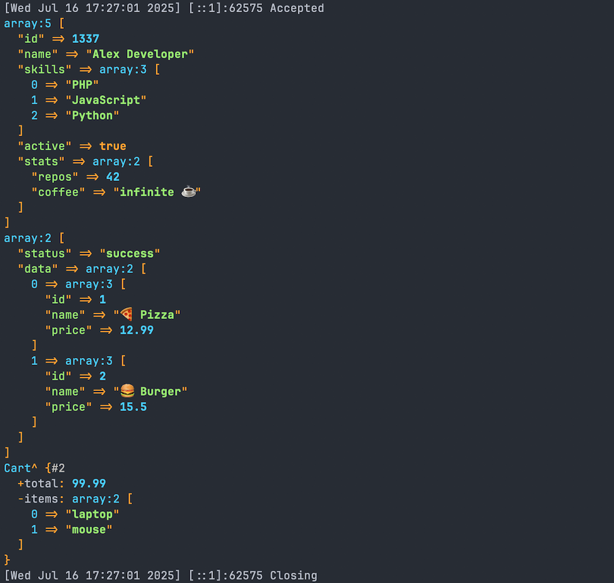

# CL - Simple PHP Console Logger

A simple PHP console logger for local development and debugging, providing beautiful and detailed variable inspection. Particularly useful when working with PHP's built-in development server. During HTTP requests, dumps are automatically redirected to stdout, keeping your responses clean while still providing detailed debugging information.



## Why use CL?

*   **Clean HTTP Responses:** Unlike `var_dump()` or `print_r()`, `cl()` sends its output directly to your terminal (stdout), ensuring your browser's HTTP response remains clean and unaffected. This is invaluable when debugging APIs, JSON responses, or simply keeping your HTML output pristine.
*   **Detailed & Beautiful Output:** Leveraging Symfony's VarDumper component, `cl()` provides highly detailed, syntax-highlighted, and easily readable dumps of any PHP variable type, from simple strings to complex objects and arrays.
*   **Non-Blocking Execution:** `cl()` dumps the variable and allows your script to continue execution, unlike `dd()` (dump and die) functions that terminate the script immediately.
*   **Lightweight & Zero Configuration:** Just install and use. No complex setup or configuration files needed.
*   **Framework Agnostic:** Works in any PHP project, regardless of the framework you're using.

> **Note on Xdebug:** `cl` is a lightweight "dump-and-continue" tool for quick inspections, not a full-fledged debugger like Xdebug. They serve different purposes; Xdebug provides powerful step-debugging, profiling, and code coverage, while `cl` offers immediate, clean variable introspection.

## Installation

```bash
composer require lemmon/cl --dev
```

> **Note:** Since this package is intended for development and debugging purposes, it's recommended to install it as a dev dependency using the `--dev` flag.

## Usage

```php
<?php

require 'vendor/autoload.php';

// Dump any variable to console
$data = ['hello' => 'world'];
cl($data);

// Works with any PHP type
cl(new stdClass());
cl(42);
cl("Hello World");
```

> **Note:** This library is a wrapper around Symfony's [VarDumper](https://symfony.com/doc/current/components/var_dumper.html) component. Any variable that VarDumper can handle will work perfectly with this library.

## Quick Example

Want to try it out? Clone this repository and run:

```bash
composer install
composer example
```

Then open your browser and navigate to http://localhost:8000. You'll see a simple message in your browser, but the real magic happens in your console where you'll see a beautifully formatted dump of various data types.

## Features

- Beautiful console output with syntax highlighting
- Detailed variable inspection
- Works with any PHP type
- Zero configuration needed
- Lightweight and simple to use
- Debug output appears in your terminal, not in the browser
- Keeps HTTP responses clean while debugging

## Requirements

- PHP 7.4 or higher

## License

This package is open-sourced software licensed under the [MIT license](LICENSE).
